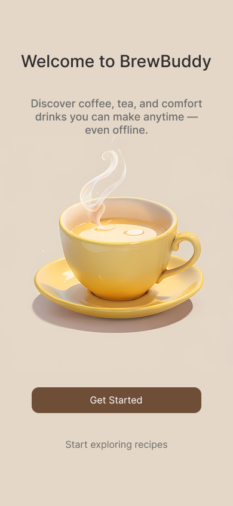
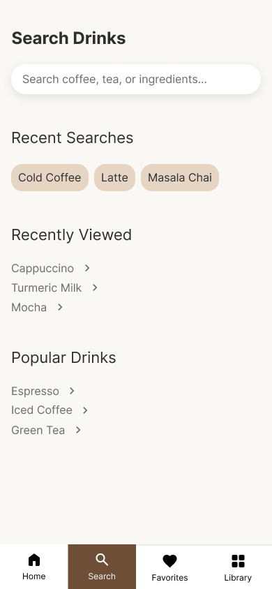
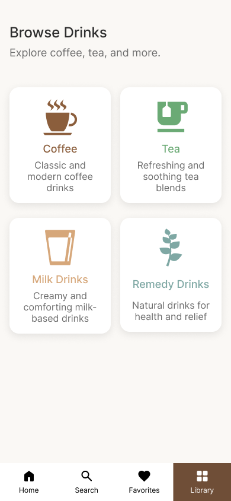
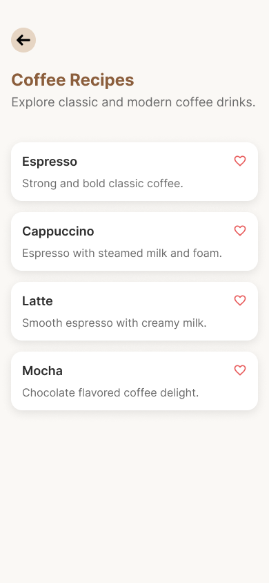
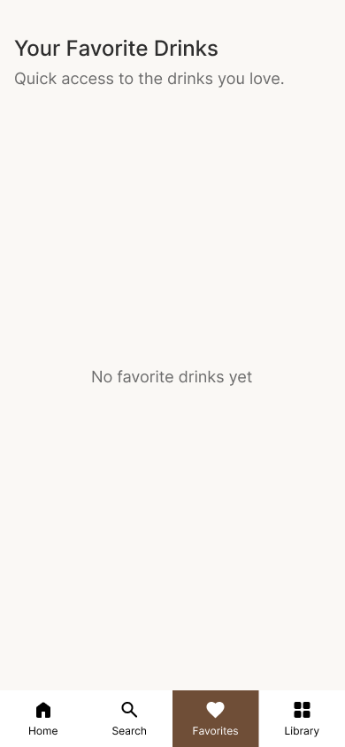

# BrewBuddy ☕

BrewBuddy is a UI/UX case study for a mobile application that helps users discover and prepare coffee, tea, and wellness drinks — even without internet access.

## 🚀 Problem

Users often search online repeatedly for drink recipes, especially in kitchens or low-network areas. There is no simple offline solution for quick access.

## 💡 Solution

BrewBuddy provides:

* Offline access to drink recipes
* Categorized browsing (Coffee, Tea, Milk, Remedy)
* Quick suggestions based on user needs
* Simple and clean UI for fast usage

## 🎯 Features

* Browse drinks by category
* Search drinks and ingredients
* View detailed recipes
* Save favorites
* Situational suggestions (headache, cold, etc.)

## 🛠 Tools Used

* Figma (UI/UX Design)

## 📱 Screens

  
  
  
  
  

## 🔗 Figma Design

https://www.figma.com/design/cJMZM1ncpcNg7f7DqegJ9d/My-Projects?node-id=838-205&t=PBTKlr3zh8kTmTES-1

## ✨ What I Learned

* Design systems (spacing, typography, colors)
* Auto Layout in Figma
* UX thinking and user flows
* Creating reusable components

---
